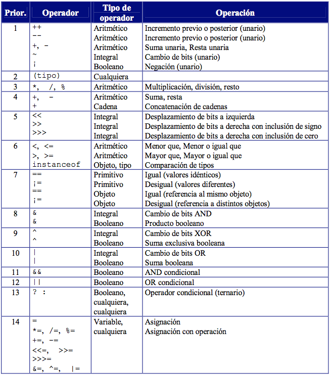

### Sección 05 - Fundamentos Java: Operadores en Java


[V24 Ejercicio: Operadores Aritméticos en Java](V24_Ejercicio_Operadores_Aritmeticos_en_Java/src/v24_ejercicio_operadores_aritmeticos_en_java/V24_Ejercicio_Operadores_Aritmeticos_en_Java.java)
* \+ Suma
* \- Resta
* \* Mulitplicación
* \/ División
* [% Resto entero de la división " operador de modulo" Saber si un número es par](V24_Ejercicio_Operadores_Aritmeticos_en_Java/src/ejemplo/Es_Par_o_Impar.java)

[V25 Ejercicio Operadore de asignación en Java](V25_Ejercicio_Operadores_de_Asignacion_en_java/src/operadores)

El operador de asignación va a evaluar todo lo que esta a su derecha ( 
analizando de izquierda a derecha ) para luego asignarselo a su variable de 
que se va a encontrar a su Izquierda. 
Al igual que en mátemáticas primero se van a resolver las multiplicaciones
y divisiones y luego las sumas y las restas. Podemos hacer una excepción usando
parentesis.

Nota: si a la deracha del operador de igualdad lo primero que nos encontramos
es una cadena, el resto va a ser todo cadena de texto y no calculos. 

* [Operador de igualdad](V25_Ejercicio_Operadores_de_Asignacion_en_java/src/operadores/Igualdad.java)
* ( = )Operador de igualdad
* [Operador de composición](V25_Ejercicio_Operadores_de_Asignacion_en_java/src/operadores/Composicion.java)
* ( += )
* ( -= )
* ( *= )
* ( /= )
* ( %= )

[V26 Ejercicio Operadores Unarios en Java](V26_Ejercicio_Operadores_Unarios_en_Java/src/Operadores_Unarios)
* [Operador de cambio de signo](V26_Ejercicio_Operadores_Unarios_en_Java/src/Operadores_Unarios/Operador_Cambio_de_Signo.java)
* [Operador de negación](V26_Ejercicio_Operadores_Unarios_en_Java/src/Operadores_Unarios/Operador_de_Negacion.java)
* [Operador de Preincremento](V26_Ejercicio_Operadores_Unarios_en_Java/src/Operadores_Unarios/Operador_de_Preincremento.java)
* [Operador de Postincremento](V26_Ejercicio_Operadores_Unarios_en_Java/src/Operadores_Unarios/Operador_de_Postincremento.java)

[V27 Ejercicio Operadores de Igualdad y Relacionales](V27_Ejercicio_Operadores_de_Igualdad_y_Relacionales/src/Operadores)
* [Operador de igualdad y desigualdad](V27_Ejercicio_Operadores_de_Igualdad_y_Relacionales/src/Operadores/Operador_Igualdad_y_Desigualdad.java)
* ( == )
* [Operadro de Igualdad en cadenas EQUALS](V27_Ejercicio_Operadores_de_Igualdad_y_Relacionales/src/Operadores/Igualdad_cadenas_equals.java)
```Java
    var resp = cadena1.equals(cadena2);
```

[V28 Ejercicio Operadores Relacionales](V28_ejercicio_operadores_ralacionales/V28_Ejercicio_Operadores_Ralacionales.java)
* ( > ) Mayor que...
* ( < ) Menor que...
* ( <= ) Menor o igual que...
* ( >= ) Mayor o igual que...
* [Ejercicio saber si una persona es mayor de edad](V28_Ejercicio_Operadores_Ralacionales/src/Ejercicio/Ejercicio_Edad_Persona.java)

[V29 Ejercicio Operadores Condicionales en Java]()

